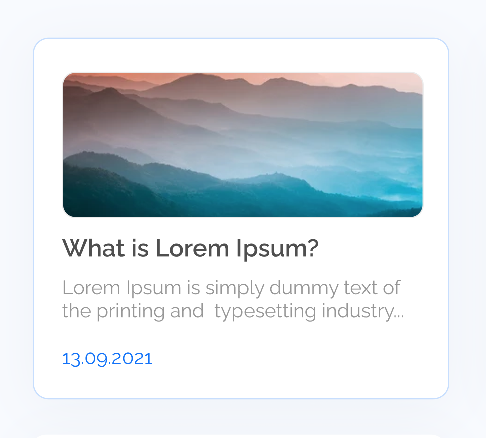
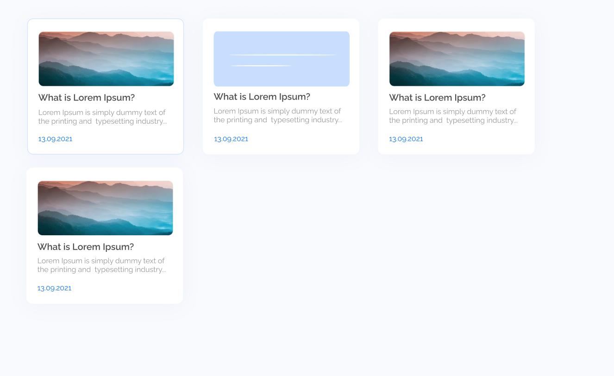

### 2. Компоненты в React

#### Домашнее задание

1. Дополнить компонент Clicker. Сделать так, чтобы когда значения кликера меньше или равно 0, то нужно спрятать кнопку "-". Если значения кликера будет больше либо равно 10 - спрятать кнопку "+".
<!-- 2. Выполнить задания 1 и 2 [тут](https://drive.google.com/file/d/1Mf998ogSXx7i2ZdIM4fy4kS2aIZClWnm/view?usp=sharing). Можно реализовать так как на картинке, а можно воспользоваться дизайном ниже
   Дизайн карточки
   
   Дизайн списка
    -->

[Дизайн в фигме](https://www.figma.com/file/L1frstXoVGaaxpLqGUGofF/Blog?node-id=0%3A1)

3. Реализовать список [эмоджи](https://github.com/dromanchuck/js-lectures/blob/master/react/emoji.md)

### [Презентанция](https://drive.google.com/file/d/1_e9dhecqfdW-tVrsYsawQNtl06ON7QXI/view?usp=sharing)

### [Видео занятия](https://drive.google.com/drive/folders/186pr9FkI3kMKPtDB5EYuMxCdVaMmSpDw?usp=sharing)

### [Код работы на занятии](../classWork)

### Читать

- [Обработчики событий](https://ru.reactjs.org/docs/handling-events.html)
- [Состояние и жизненный цикл](https://ru.reactjs.org/docs/state-and-lifecycle.html)
- [Условный рендеринг](https://ru.reactjs.org/docs/conditional-rendering.html)
- [Списки и ключи](https://ru.reactjs.org/docs/lists-and-keys.html)
- [Введение в хуки](https://ru.reactjs.org/docs/hooks-intro.html)
- [useState](https://ru.reactjs.org/docs/hooks-state.html)

### Подготовка к следующему занятию

- [Формы](https://ru.reactjs.org/docs/forms.html)
- [useEffect](https://ru.reactjs.org/docs/hooks-effect.html)
- [список хуков](https://ru.reactjs.org/docs/hooks-reference.html)
- [ajax и react](https://ru.reactjs.org/docs/faq-ajax.html)
