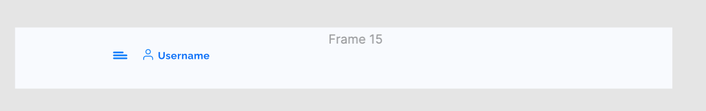
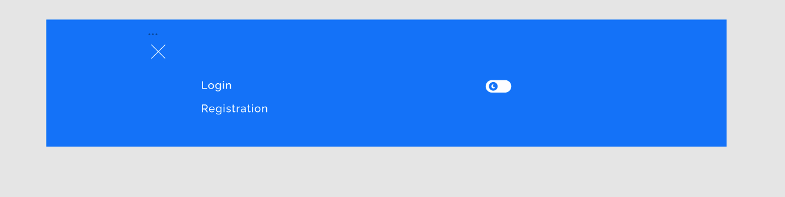
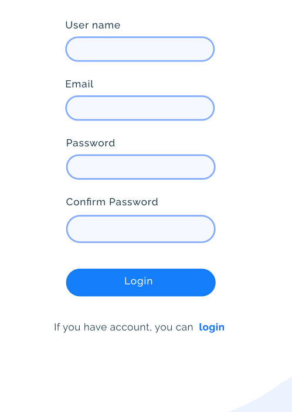

### 4. Хуки в React

#### Домашнее задание

1. Разобраться с работой кода, чтобы мы сделали на занятии
2. Реализовать компонент Header, по нажатию на иконку гамбургера, должен открываться навигационный бар
   Header
   
   NavBar
   
   [Дизайн тут](https://www.figma.com/file/L1frstXoVGaaxpLqGUGofF/Blog?node-id=0%3A1)

3. Реализовать конвертер валюты из доллара в беларуские рубли и наоборот. Курс доллара к рублю использовать на момент решение этой задачи :)
   Пример как должен выглядеть конвертер:
   

4. Реализовать компонент Time, который будет показывать текущее время в формате ЧАСЫ:МИНУТЫ:СЕКУНДЫ. В этом вам поможет поработать с объектом [Date](https://developer.mozilla.org/ru/docs/Web/JavaScript/Reference/Global_Objects/Date/toLocaleTimeString). Должно работать вот так:
   

5. Реализовать компонент Timer. Описание и пример работы (тут)[https://github.com/dromanchuck/js-lectures/blob/master/react/timer.md]

6. Реализовать форму регистрации по аналогии как мы делали форму Login на занятии
   

### [Видео занятия](https://drive.google.com/drive/folders/1NU041IZ1pZVG68Xw9iuZda1rsf1rCg_J?usp=sharing)

### (Жизненный цикл компонента)[https://drive.google.com/file/d/1_e9dhecqfdW-tVrsYsawQNtl06ON7QXI/view?usp=sharing]

### (Хуки в React)[https://drive.google.com/file/d/1b6ZriOCBMw_08RRid7aEu3nhi7gRMkv6/view?usp=sharing]

### [Код работы на занятии](../classWork)

### Читать/Смотреть

- [useEffect](https://ru.reactjs.org/docs/hooks-effect.html)
- [список хуков](https://ru.reactjs.org/docs/hooks-reference.html)
- [ajax и react](https://ru.reactjs.org/docs/faq-ajax.html)
- [useCallback](https://ru.reactjs.org/docs/hooks-reference.html#usecallback)
- [useMemo](https://ru.reactjs.org/docs/hooks-reference.html#usememo)
- [Фрагменты](https://ru.reactjs.org/docs/fragments.html)
- [Еще немного про useEffect][https://metanit.com/web/react/6.3.php]
- [Дом элементы](https://ru.reactjs.org/docs/dom-elements.html)

### Подготовка к следующему занятию

- [Компонент высшего порядка](https://ru.reactjs.org/docs/higher-order-components.html)
- [Подъем состояния](https://ru.reactjs.org/docs/lifting-state-up.html)
- [useRef](https://ru.reactjs.org/docs/hooks-reference.html#useref)
- [Context](https://ru.reactjs.org/docs/context.html#gatsby-focus-wrapper)
