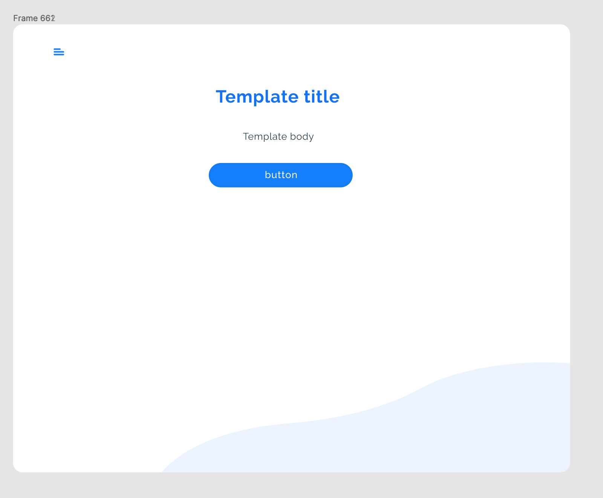
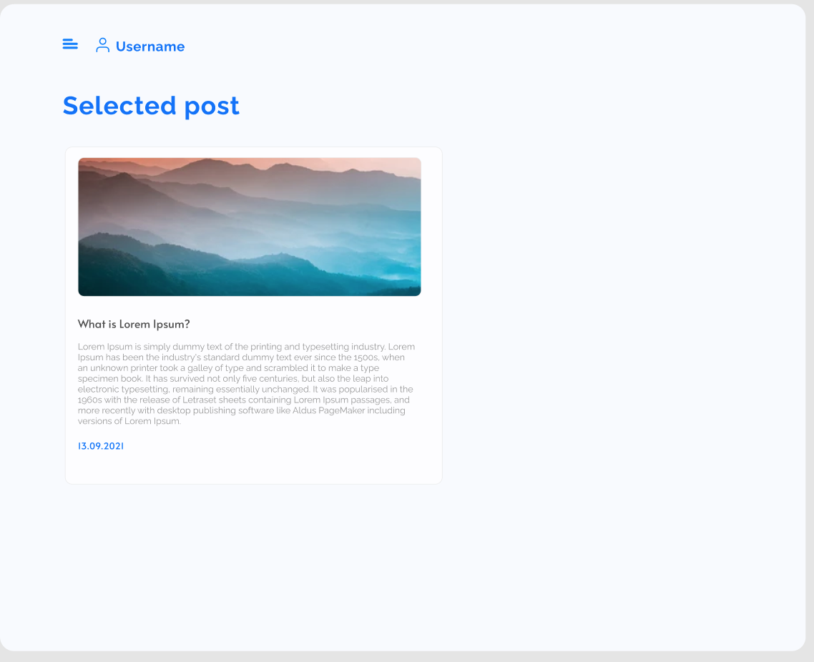
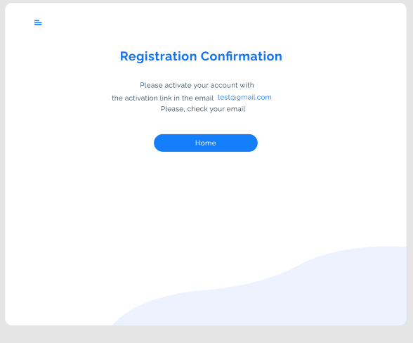
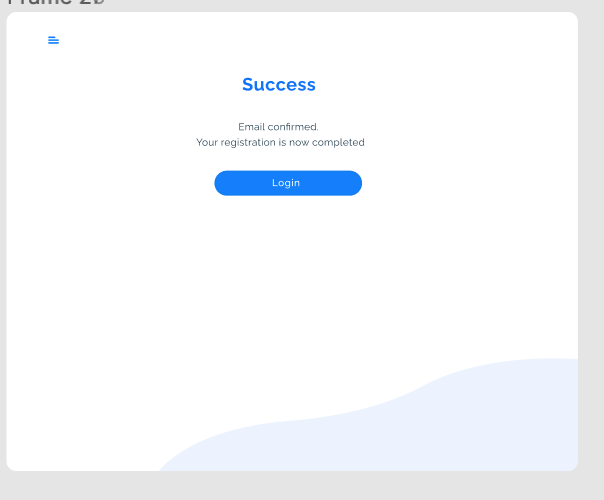

### 6. Роутинг в React

#### Домашнее задание

1. Разобраться с работой кода, чтобы мы сделали на занятии
2. Поработать над блогом, в нем должны быть готовы следующие пункты

- добавлена базовая навигация с роутам '/', '/registration', '/login'
- каждая страница должна быть обернута в компонент Container с использованием пропа children,
  этот контейнер будет шаблоном для всех страниц (текст и кнопки не учитываем, только бэкграунд и картинка в левом нижнем углу)
  
- Применить для всего приложения темную/светлую тему

3. Добавить страницу SelectedPost (обязательно добавить в роутер)
   
   Страница должна содержать компонент Header и компонент FullPost, который будет принимать те же пропсы как и карточка поста. Данные в этот компонент передать из папки mocks

4.Сделать компонент шаблона информационных страниц InfoTemplate,
этот компонент использовать для создания новых страниц:

- RegisterSuccuss
  
- EmailConfirmed
  

### [Видео занятия](https://drive.google.com/file/d/1A913cTG8YVdzST1KqBRBRUJf8aGb9TpT/view?usp=sharing)

### [Роутинг в React](https://drive.google.com/file/d/1FbDobYSrFB0KyBNDmU5Suks29_Iy4-dm/view?usp=sharing)

### [Код работы на занятии](../classWork)

### Читать

- [Роутинг в реакт](https://reactrouter.com/en/main/getting-started/overview)
- [Еще про роутинг](https://metanit.com/web/react/4.1.php)
- [Посмотреть про роутинг](https://www.youtube.com/watch?v=vKgZkGVhzrk)
- [Компонент BrowserRouter](https://reactrouter.com/en/main/routers/browser-router)
- [Компонент Link](https://reactrouter.com/en/main/components/link)
- [NavLink](https://reactrouter.com/en/main/components/nav-link)
- [Как подключать роутер (инструкция)](https://reactrouter.com/en/main/getting-started/tutorial#connect-the-url)
- [Примеры работы с роутером в версии 5 (в версии 6 все то же самое)](https://v5.reactrouter.com/web/example/basic)
  Можно пролистать всё во вкладке Examples, там собрано куча примеров работы с роутингом
